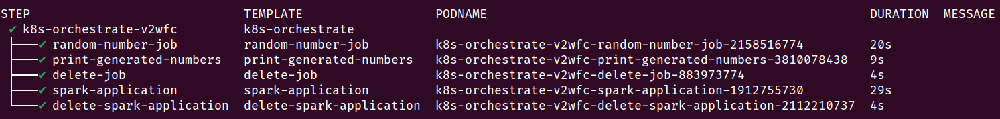
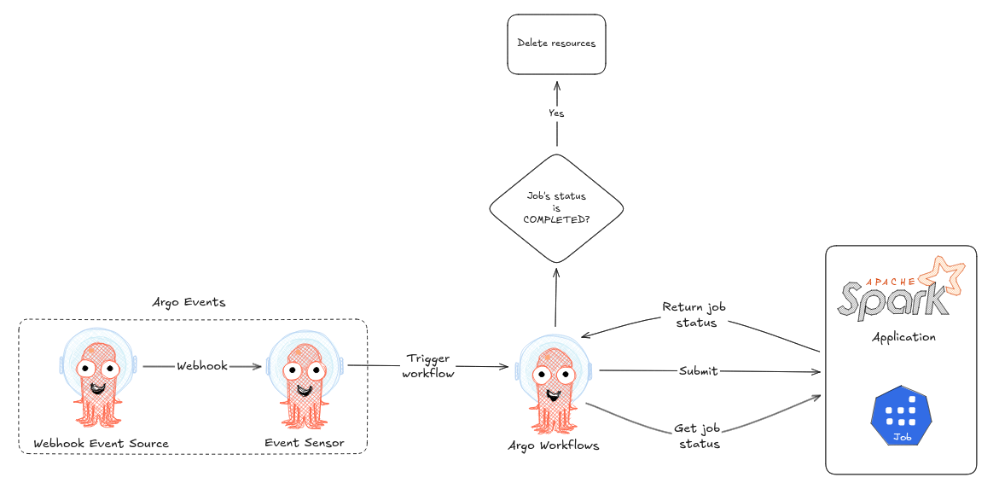

# Best of Argo Workflows

## Install Argo Workflows on your K8s cluster

```bash
kubectl create namespace argo # If does not exist
kubectl apply -n argo -f https://github.com/argoproj/argo-workflows/releases/download/v3.7.3/install.yaml # Latest release
```

## Create `playground` namespace

```bash
kubectl create namespace playground # Workflows as well as other resources are created in this namespace
```

## Create required resources 

```bash 
kubectl apply -f roles/ # This service account is used in Workflow CRDs
# CAUTION Make sure you have already created the secret `s3-credentials` referenced in the configmap
kubectl apply -f configmap/artifact-repository.yaml # Holds S3 credentials and configurations
```

## Submit a pipeline

### Example
```bash
# Make sure you have argo CLI already installed (see: https://github.com/argoproj/argo-workflows/releases/tag/v3.7.3)
argo submit -n playground pipelines/artifact.yaml --watch
```

### Check the status of your pipeline

```bash
# You can also use --watch with argo submit to track the workflow progress (see above example)
argo get @latest -n playground
```

### Run a spark application, track its progress and delete it

(1) Deploy the Kubeflow Spark operator into your K8s cluster

```bash
# To run your Spark jobs in a namespace called playground.
# This will also create a serviceaccount in playground namespace and 
# driver pod will use it to communicate with K8s API server (e.g., create executor pods).
cd helm/charts
helm upgrade --install -n spark-operator spark-operator ./spark-operator -f ./spark-operator/values.yaml --create-namespace --set "spark.jobNamespaces={playground}"
```

(2) Run the workflow 

```bash
argo submit -n playground pipelines/k8s-orchestration.yaml --watch
```



### Trigger an Argo Workflow using Argo Events

Suppose you want to trigger one of your workflows using a webhook - you can use Argo Events to achieve this.

(1) Install Ago Events on your K8s cluster

```bash
kubectl create namespace argo-events
kubectl apply -f https://raw.githubusercontent.com/argoproj/argo-events/stable/manifests/install.yaml
kubectl apply -f https://raw.githubusercontent.com/argoproj/argo-events/stable/manifests/install-validating-webhook.yaml
```

(2) Create EventBus pods

```bash
kubectl apply -n argo-events -f https://raw.githubusercontent.com/argoproj/argo-events/stable/examples/eventbus/native.yaml
```

(3) Set up the event source for the webhook — this is one of the possible event source types supported by Argo Events.

```bash
kubectl apply -f events/source/webhook.yaml
```

(4) Create a service account with the necessary RBAC permissions to allow the sensor to trigger an Argo Workflow in the `playground` namespace.
In this setup, I created a `ClusterRole`, which enables the workflow to be created in any namespace.
Alternatively, you can create a **namespace-scoped Role** in `playground` and bind it to a service account in the `argo-events` namespace to achieve the same result with more restricted permissions.

```bash
kubectl apply -f events/roles
```

(5) Port-forward (dev mode) the service that was created when you configured the webhook event source.

```bash
kubectl -n argo-events port-forward svc/webhook-eventsource-svc 12000:12000
```

(6) Trigger the Workflow  

```bash
curl -d '{}' -H "Content-Type: application/json" -X POST http://localhost:12000/example
```

(7) Verify that an Argo Workflow was triggered

```bash
kubectl -n playground get workflows | grep k8s-orchestrate
```

